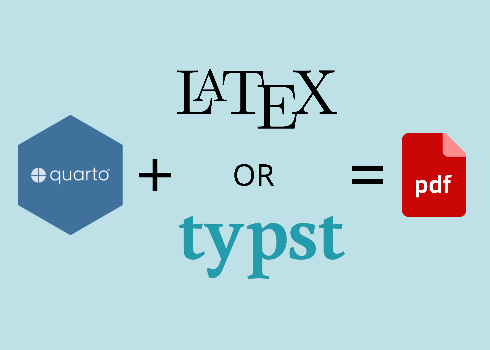

# CV automated formatting with Quarto and typstcv

My CV and resume (various versions in ENG and ITA) made with quarto & the **`typstcv`** R pckg (See [source code](https://github.com/kazuyanagimoto/typstcv) here). 

+ The CV/resume (different versions) is written in `*.qmd` files.
+ My information are stored in `data/` folder as `*.csv` files.
+ My publications/talks are stored in `data/` folder as `*.bib` files.
+ I started form the `typstcv` template file and then make some formatting changes tweaking the `_extensions/lulliter/awesomecv/typst-template.typ`. 
+ The final CVs are stored in the `docs/` folder ("gitignored") as `*.pdf` files.
+ The `renv.lock` file is used to keep track of the R environment (🤞🏻).
	- Do `renv::status()` to check the status of the environment (project may be ahead or behind the lockfile).
	- Do `renv::snapshot()` to update the lockfile (and put it in sync with the project).

# TO DO 

+ redo the `*.csv` files with the `data/` folder for a PHARMA resume
+ 🟠 CAmbiare CV lungo come CV anonimo su: pubb, seminari e DS proj

## What is `typst`?

[`typst`](https://github.com/typst/typst) is a new markup-based typesetting system that is designed to be as powerful as `LaTeX` while being much easier to learn and use.

<!-- ](images/typst.png){width=50%} -->
<!--  -->
<figure>
  
  <figcaption>Source: <a href="https://nrennie.rbind.io/blog/pdf-quarto/making-pdf-with-quarto-typst-latex/">Nicola Rennie's blog post</a></figcaption>
</figure>
It can be installed on macOS with

``` bash
# shell
brew install typst
```

### How do `typst` and `Quarto` interact?

Check it out [here](https://quarto.org/docs/output-formats/typst.html)

With the latest 1.4 release of Quarto, you can now use `typst` as an output format!

``` bash
# shell
quarto --version # 1.4.550
```

### How to use `typst` as a format?

``` yaml
# YAML
---
title: "Hello Typst!"
format: typst
---
```

### How to use `typstcv` (specifically) as a format?

[`typstcv`](https://kazuyanagimoto.com/typstcv/) provides helper functions for rendering a CV like [this](kazuyanagimoto/quarto-awesomecv-typst).

This can be installed with:

``` r
# R
install.packages("typstcv", repos = "https://kazuyanagimoto.r-universe.dev") 
```

Basically it is a `*.qmd` file that has format...

``` yaml
# YAML 
---
format:
  awesomecv-typst:
    font-paths: ["PATH_TO_FONT"]
---    
```

...and is rendered into a `*.pdf` file.

-   it allows fontawesome icons
-   it allows SVG icons
-   it basically helps with a `resume_entry()` function that makes it easier to write a CV.
-   the final, rendered, `cv*.pdf` files are saved in the `docs/` folder

Under the hood, the extension `awesomecv-typst` has 2 key files: 

+ `_extensions/kazuyanagimoto/awesomecv/typst-template.typ` \~ the core template file. It defines the styling of the document. 
+ `_extensions/kazuyanagimoto/awesomecv/typst-show.typ` \~ a file that calls the template. It maps Pandoc metadata to template function arguments. .

# Output 
This is how my final CV renders:

<!-- <iframe src="docs/LMM_CV_eng.pdf#view=FitH" width="100%" height="500px" style="border:none;"></iframe> -->


# Acknowledgments

I am grateful for the very helpful work of [Kazuharu Yanagimoto](https://kazuyanagimoto.com/), who is the creator of the `typstcv` [package](https://kazuyanagimoto.com/typstcv/) 👏🏻.
